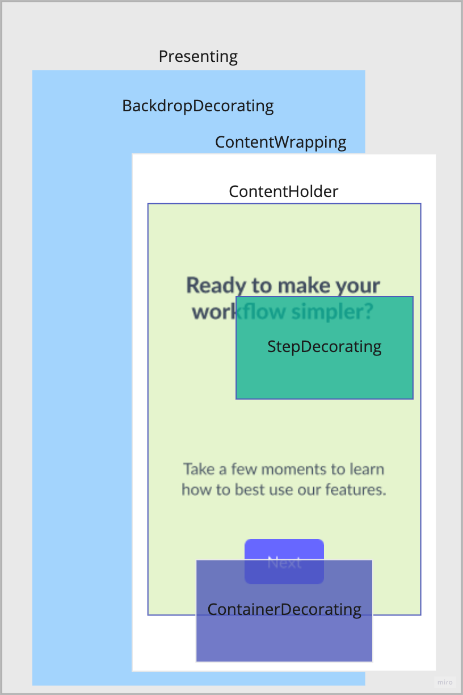

# Understanding the Experience Trait System

Experiences displayed by the Appcues Android SDK are customizable and extensible via a flexible system of Experience Traits.

## Overview

An `ExperienceTrait` modifies the how an entire experience, or a particular step in an experience is displayed. 
A trait of a specific _type_ has _capabilities_ that modify the way an experience is displayed to the user. 
Furthermore a trait can be applied at multiple _levels_ which determines which parts of the experience are impacted by the trait instance.

## Trait Types

Every trait has a `type` property that must be a unique name identifying the trait. 
Best practice is to prefix the `type` with your organization name, resulting in the format `@org/name` (e.g. `@appcues/modal`).

Attempting to register a trait for a type that exists already log an `AppcuesDuplicateTraitException`.

## Trait Capabilities

An experience trait must adopt at least one of the following capabilities to have any effect, and may adopt more than one for more complex functionality.

Each trait type is applied to a specific part of the [composition](https://developer.android.com/jetpack/compose). Some types of traits only allow a single instance to be applied to rendered content, for example a `PresentingTrait`. Other types, for example `StepDecorating`, can have multiple instances applied to the same rendered content, in which case they are applied in sequence.

<p align="center">
  
</p>

### Presenting

A ``PresentingTrait`` is the trait responsible for providing the view in which the experience will be shown. by default we are starting our `AppcuesActivity` that will orchestrate all other traits to ensure the proper order and placement of elements are correct.

> Only a single ``PresentingTrait`` will be applied in the process of displaying an experience step even if multiple are defined.

> In the current version is not viable to customize a PresentingTrait since there is a lot of internal dependencies that are needed for it to work properly.

### Backdrop Decorating

A  ``BackdropDecoratingTrait`` draws content behind the content wrapper.

> Not all experiences will include a backdrop, and a ``BackdropDecoratingTrait`` will not be invoked if the experience does not include a backdrop.
> Multiple ``BackdropDecoratingTrait`` will be applied in sequence.

### Content Wrapping

A ``ContentWrappingTrait`` is responsible for wrapping the content in a container that will be presented to the user. It is possible to create different types of containers for your content other than dialogs, bottom sheet, full screen like the ones we already have.

> Only a single ``ContentWrappingTrait`` will be applied in the process of displaying an experience step even if multiple are defined.

### Content Holder

A ``ContentHolderTrait`` is responsible for organizing all steps within that wrapped content. by default we will only show the first step and only by using an action user will be able to move to the next one, but in case of the carousel its possible to swipe through the steps in that wrapper content.

### Step Decorating

A ``StepDecoratingTrait`` draws content on top of the content in that particular step. For example, positioning sticky content overlaid on top.

### Container Decorating

A ``ContainerDecoratingTrait`` draws content on top of the content wrapper. It is used to overlay content on top of all steps within container, for example a close button.

## Trait Levels

The Appcues mobile experience data model allows for traits to be specified at the experience level, at the step-group level, or at the step level.

- Experience-level traits modify the entire experience and are applied when any step of the experience is being displayed.
- Group-level traits apply when any of child steps of the group is being displayed.
- Step-level `Decorating` traits are scoped to be applied only when the specific step is being displayed. A `Creating` or `Presenting` trait set at the step-level will be ignored because applying them would leak beyond the specific step an impact the display of any sibling steps.

In practice this distinction looks like this in the experience data model:

```json
{
    ...
    "traits": [
        // Experience-level traits
        // Presenting and Creating traits propagated to each group
        // Decorating traits are propagated to every child step
    ],
    "steps": [
        {
            ...
            "traits": [
                // Group-level traits
                // Presenting and Creating traits are applied, taking precedence over traits of the same type at the experience-level
                // Decorating traits are propagated to every child step in the group
            ],
            "children": [
                {
                    ...
                    "content": { ... },
                    "traits": [
                        // Step-level traits for the first step
                        // Presenting and Creating traits are ignored
                        // Decorating traits only
                    ]
                }
            ]
        },
        {
            ...
            "content": { ... },
            "traits": [
                // Step-level traits for the second step
                // Presenting and Creating traits are ignored
                // Decorating traits only
            ]
        }
    ]
}
```

Only a single instance of each trait type may be included in the `traits` array at any given level. If multiple traits with the same `type` are included in the same array, the experience is invalid, an error will be logged, and the experience will not display. 
The most specific instance of a trait type will take precedence over a trait of the same type specified at a higher level.

A trait is made aware of the level at which it is being applied by the `ExperienceTraitLevel` as its initially mapped from json into `LeveledTraitResponse`. 
A trait can have different behavior depending on the `level` at which it is applied.

For example, a trait might simultaneously conform to `ContainerDecoratingTrait` and `StepDecoratingTrait` and the choose to apply it's decoration in only one of those contexts:
```kotlin
@Composable
override fun BoxScope.DecorateStep(
    containerPadding: PaddingValues,
    safeAreaInsets: PaddingValues,
    stickyContentPadding: StickyContentPadding,
) {
    if (level == STEP) Decorate()
}

@Composable
override fun BoxScope.DecorateContainer(
    containerPadding: PaddingValues,
    safeAreaInsets: PaddingValues,
) {
    if (level == GROUP) Decorate()
}

@Composable
private fun BoxScope.Decorate() { ... }
```

## Sharing Data Across Traits

There may be cases where values or data from one trait type are required for the successful rendering of another trait type. Similarly, there may be cases where you wish to coordinate a transition between traits of the same type applied at the step-level. 
In both these cases, the `MetadataSettingTrait` provides a mechanism to share data across trait instances.

on every configuration change, all `MetadataSettingTrait` will run `produceMetadata` adding mapped values to a shared dictionary that can later be retrieved by requesting `LocalAppcuesStepMetadata.current` on your trait composition.

For example, there is a trait `@appcues/step-transition-animation` sets an object on key: `stepTransitionAnimation` that will later be used by various traits to sync up animation.

## Error Handling

There may be cases where a trait is unable to perform its intended capability. If this happens, it's preferred that a non-essential trait fail silently so that the experience can still be displayed to the user. However if a trait implementation is essential, it may throw a ``AppcuesTraitException`` that will prevent the experience from being displayed and log an error with the Appcues platform.
