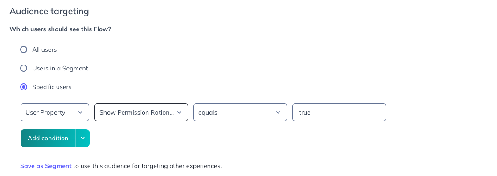

# Android permission primers

Sometimes its necessary to ask users for specific permissions, given that all apps are limited to access to user private data, at any given
moment your application might need special access to camera, storage data, etc…

Following google [guidelines](https://developer.android.com/training/permissions/requesting), it is highly recommended to explain why you
want that permission for before asking for any runtime permission specially on the second time around, and you can leverage Appcues to help
you with that, providing a flow that explains why that permission is required for feature.

> 👉 There are many ways to set up a flow to display and request permission.
> Consider this a starting point, though its a working solution it might require extra considerations to fit your needs.

## Android Setup

1. lets add the permission to the AndroidManifest.xml

```xml

<manifest>

    <uses-permission android:name="android.permission.CAMERA" />

    <application>
        .
        .
    </application>

</manifest>
```

2. On the screen we want to use camera permission, lets define a permission request constant

```kotlin
const val CAMERA_PERMISSION_REQUEST_CODE = 1234
```

3. Guard the method that uses the camera permission with this:

```kotlin
when {
    // permission is granted
    ContextCompat.checkSelfPermission(baseContext, Manifest.permission.CAMERA) == PackageManager.PERMISSION_GRANTED -> {
        performAction() // use camera feature
    }
    // permission is not granted yet && shouldShowRequestPermissionRationale returns false
    ActivityCompat.shouldShowRequestPermissionRationale(activity, Manifest.permission.CAMERA).not() -> {
        // request permission
        ActivityCompat.requestPermissions(activity, arrayOf(Manifest.permission.CAMERA), CAMERA_PERMISSION_REQUEST_CODE)
    }
}
```

> ⚠️ In this Example we use `ActivityCompat` which may have different results on API below 23!

4. implement `OnRequestPermissionsResultCallback` and wait for the return of permission where the request code
   is `CAMERA_PERMISSION_REQUEST_CODE` , update `showPermissionCameraRationale` accordingly.

```kotlin
override fun onRequestPermissionsResult(requestCode: Int, permissions: Array<out String>, grantResults: IntArray) {
    super.onRequestPermissionsResult(requestCode, permissions, grantResults)

    if (requestCode == CAMERA_PERMISSION_REQUEST_CODE) {
        // permission was granted
        if (grantResults.isNotEmpty() && grantResults[0] == PackageManager.PERMISSION_GRANTED) {
            performAction() // use camera feature
            // update property to false
            userProps["showPermissionCameraRationale"] = false
        // permission denied
        } else {
            // update property to reflect whether to show permission rationale
            userProps["showPermissionCameraRationale"] =
                ActivityCompat.shouldShowRequestPermissionRationale(requireActivity(), Manifest.permission.CAMERA)
        }
    }
}
```

5. Final piece for the activity, register AnalyticsListener

```kotlin
appcues.analyticsListener = object : AnalyticsListener {
    override fun trackedAnalytic(type: AnalyticType, value: String?, properties: Map<String, Any>?, isInternal: Boolean) {

        if (type == AnalyticType.EVENT && value == "request-permission-camera") {
            // listen for "request-permission-camera" EVENT that will be sent by the permission primer flow
            ActivityCompat.requestPermissions(activity, arrayOf(Manifest.permission.CAMERA), CAMERA_PERMISSION_REQUEST_CODE)
        }
    }
}

appcues.screen("screen_name")
```

> 👉 Note that “request-permission-camera” is a random string we are defining here, that will later tie things together with our Flow.

> 💡 This setup is taking into account that you will be calling appcues.screen(”screen_name”) on the given screen. 
> The implementation details is open to change depending on your app’s requirements.

## Studio/Builder Setup

1. On Appcues studio page, create a new flow explaining why that permission is important for your feature, here is an example:

<p align="center">
  
</p>

2. Change the “Continue/OK” provided in your flow to include a track event like this one:

<p align="center">
  
</p>

3. When you are done editing your flow, go back to the settings page and add how you are targeting this audience. Lets set to target users property “showPermissionCameraRationale” is equal to "true".

<p align="center">
  
</p>

4. And now, make sure to trigger this flow at screen(”screen_name”)

<p align="center">
  
</p>
